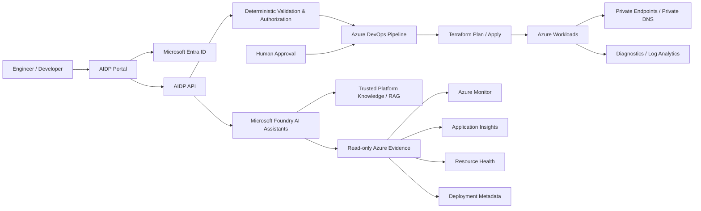
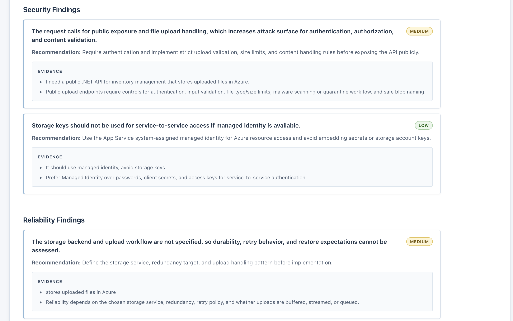
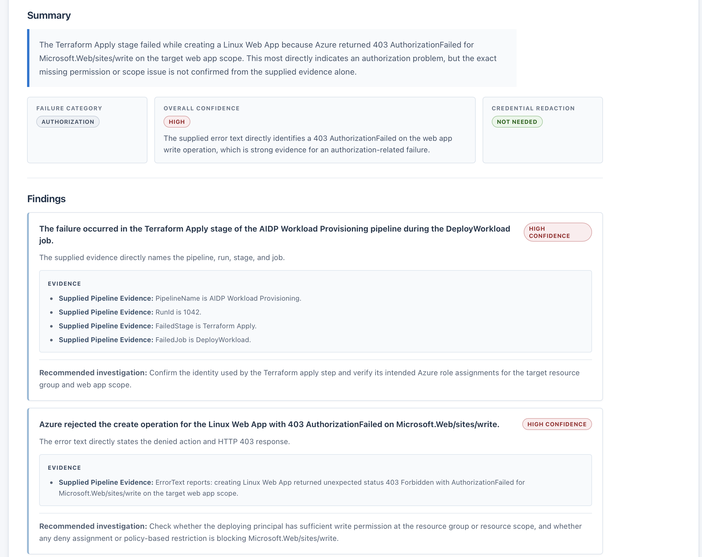
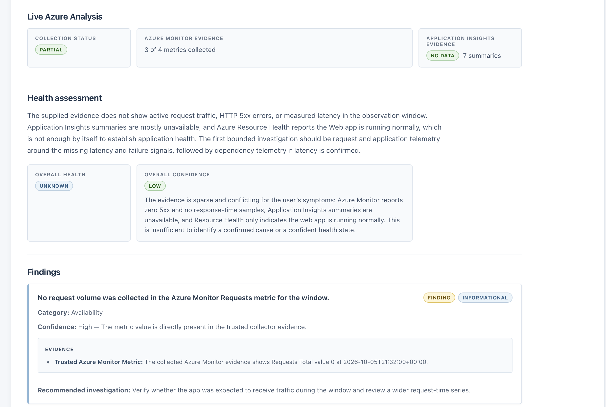
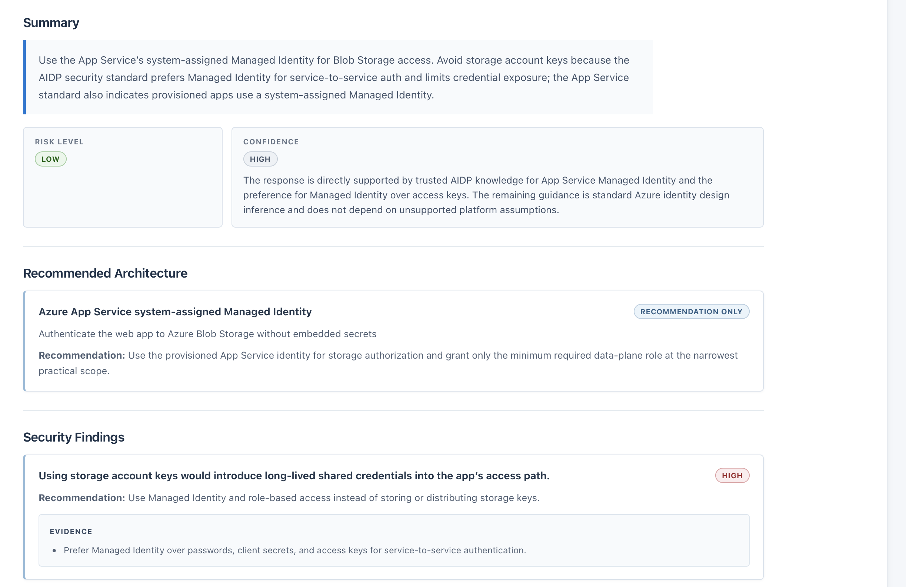

# Azure Intelligent Developer Platform (AIDP)

AIDP is a secure self-service Azure platform that combines **Infrastructure as Code, CI/CD, private networking, observability, and safety-bounded AI assistants**.

It was built as a hands-on Cloud / DevOps / Platform Engineering project to demonstrate how Azure infrastructure delivery and AI-assisted operations can be designed with strong security boundaries, least privilege, and human approval.

> **Portfolio note:** this repository is a sanitized public representation. It contains no live subscription identifiers, credentials, Terraform state, private endpoints, or environment-specific secrets.

## Why this project matters

Modern platform teams are expected to make cloud delivery faster without giving up governance. AIDP demonstrates that balance by combining:

- self-service workload provisioning;
- Terraform-based Azure infrastructure;
- Azure DevOps YAML pipelines with approvals;
- Workload Identity Federation and Managed Identity;
- scoped RBAC and least-privilege design;
- Private Link and Private DNS;
- Azure Monitor, Application Insights, and Log Analytics;
- Microsoft Foundry-backed AI assistants;
- trusted RAG and provenance-aware evidence;
- deterministic evaluation and AI safety gates.

## What the platform can do

AIDP supports a controlled developer workflow where an authenticated user can request supported infrastructure, have the request validated, and route deployment through Azure DevOps and Terraform with human approval.

The AI layer can:

- review infrastructure configurations;
- troubleshoot deployment failures;
- analyze application health;
- use trusted platform knowledge through RAG;
- incorporate bounded read-only evidence from Azure Monitor, Application Insights, Resource Health, and deployment metadata.

The AI **cannot** deploy infrastructure, change RBAC, restart workloads, approve releases, execute Terraform, or perform autonomous remediation.

## Architecture



See [`docs/architecture-overview.md`](docs/architecture-overview.md) for a concise architecture walkthrough.

## Key engineering decisions

### Identity before secrets

Azure access is designed around **Managed Identity** and **Workload Identity Federation** instead of long-lived credentials wherever possible.

### Human approval remains authoritative

AI recommendations never bypass deterministic validation, deployment controls, or human approval.

### Read-only AI evidence

Operational AI analysis uses bounded, allowlisted Azure evidence rather than arbitrary resource browsing, arbitrary KQL, or model-selected write operations.

### Private service connectivity

The project demonstrates Private Endpoints, Private DNS, and default-deny networking patterns for selected Azure services.

### Observability as a platform capability

Diagnostic settings, Log Analytics, Application Insights, Azure Monitor, and Resource Health are treated as part of the platform rather than an afterthought.

## Security & AI safety

The security model separates authentication, authorization, deployment authority, and AI advice.

Key controls include:

- Microsoft Entra ID authentication;
- deterministic backend validation;
- scoped RBAC;
- Managed Identity;
- Workload Identity Federation;
- private networking patterns;
- structured AI outputs;
- provenance-aware evidence;
- credential sanitization;
- groundedness checks;
- prompt-injection and adversarial evaluation;
- human approval before infrastructure changes.

More detail:

- [`docs/security-model.md`](docs/security-model.md)
- [`docs/ai-safety.md`](docs/ai-safety.md)
- [`docs/evaluation.md`](docs/evaluation.md)

## Repository layout

```text
src/Aidp.Api/              Authenticated API, collectors, AI services, validation, and safety controls
src/Aidp.Portal/           React/Vite portal and MSAL integration
terraform/                 Sanitized example platform and workload infrastructure
pipelines/                 Azure DevOps pipeline templates
azure-pipelines*.yml       Platform and workload delivery flows
tests/Aidp.Api.Evals/      Deterministic AI evaluation suites
tests/Aidp.Api.AuthChecks/ Authentication and integration checks
docs/                      Architecture, security, operations, and AI safety documentation
```

## Technologies demonstrated

**Azure:** App Service, Storage, Microsoft Entra ID, Managed Identity, RBAC, Private Link, Private DNS, Azure Monitor, Application Insights, Log Analytics, Resource Health, Microsoft Foundry

**DevOps / IaC:** Terraform, Azure DevOps, YAML pipelines, Git, approvals, Workload Identity Federation

**AI platform engineering:** trusted RAG, structured outputs, provenance, safety validation, deterministic evaluations, bounded read-only Azure evidence

**Application stack:** .NET, React, Vite, MSAL

## Current project status

Core platform capabilities are implemented in the private lab environment and represented here in sanitized form, including:

- Terraform-based Azure infrastructure;
- platform and workload CI/CD flows;
- Entra authentication;
- self-service workload provisioning;
- AI infrastructure review;
- deployment troubleshooting;
- health analysis;
- trusted RAG;
- live Azure telemetry evidence;
- AI safety/evaluation gates;
- diagnostic settings and private networking controls.

Current work focuses on additional security hardening, observability, cost controls, and portfolio polish.

## Running locally

Copy `src/Aidp.Portal/.env.example` to `.env.local`, replace the placeholder Entra values with values from a private test registration, and configure private Azure settings outside this repository.

Do not commit local environment files, Terraform state, deployment artifacts, or credentials.

## Application Preview

These screenshots show the portfolio application running in a controlled lab environment. They are representative product evidence, not screenshots from a public production environment.

### AI Infrastructure Review

The assistant reviews architecture requests with Microsoft Foundry, deterministic validation, and trusted AIDP platform knowledge. It distinguishes supported platform capabilities from recommendation-only components.



*Structured infrastructure guidance with platform-aware recommendations.*

Additional captures are in [`docs/media/ai-infrastructure-review`](docs/media/ai-infrastructure-review/).

### AI Deployment Troubleshooting

The assistant analyzes supplied pipeline and Terraform evidence, classifies likely failures, shows supporting evidence and confidence, and recommends investigation without performing remediation or rerunning deployments.



*Evidence-based troubleshooting remains advisory and read-only.*

Additional captures are in [`docs/media/ai-deployment-troubleshooting`](docs/media/ai-deployment-troubleshooting/).

### AI Application Health

AIDP supports both supplied-evidence analysis and live read-only Azure analysis using Azure Monitor, Application Insights, Resource Health, and deployment metadata.

The live-health capture intentionally demonstrates evidence-aware behavior: Azure Monitor reported no active request traffic or HTTP 5xx errors in the observed window, response-time samples were unavailable, Application Insights data was insufficient, and Resource Health reported the web app running normally. AIDP correctly returned **UNKNOWN** health with **LOW** overall confidence instead of inventing a root cause.



*Conservative health assessment when telemetry is incomplete.*

Additional captures are in [`docs/media/ai-application-health`](docs/media/ai-application-health/).

### Trusted Platform Knowledge / RAG

Infrastructure reviews retrieve approved AIDP knowledge and distinguish trusted platform guidance from model inference.

The captured Managed Identity example recommends a system-assigned Managed Identity for App Service, Azure RBAC for Blob Storage access, avoiding storage account keys and other long-lived shared credentials, and least-privilege scope.



*Trusted platform guidance grounds the assistant’s recommendations.*

Additional captures are in [`docs/media/rag`](docs/media/rag/).

## Author

**Andres Stein**  
Cloud / DevOps / Platform Engineer
