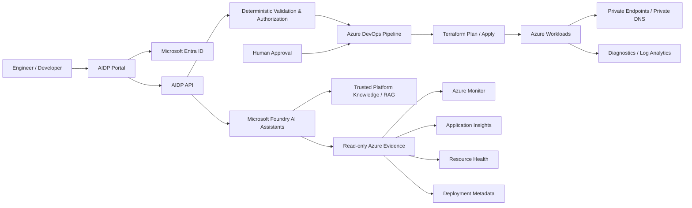

# Architecture Overview

This page gives a recruiter-friendly view of the Azure Intelligent Developer Platform (AIDP).

## Control boundaries

- **Authentication:** Microsoft Entra ID identifies callers.
- **Authorization and validation:** deterministic backend rules decide what the platform will accept.
- **Infrastructure delivery:** Azure DevOps and Terraform perform approved changes.
- **AI role:** assistants explain, review, troubleshoot, and analyze evidence; they do not receive deployment authority.
- **Azure access:** Managed Identity and scoped RBAC are used for read-only operational evidence and service-to-service access.
- **Networking:** Private Link, Private DNS, and default-deny storage controls demonstrate private service connectivity patterns.
- **Observability:** Azure Monitor, Application Insights, Log Analytics, Resource Health, and deployment metadata provide trusted operational evidence.

## Portfolio scope

This public repository is a sanitized portfolio representation of the project. Live subscription identifiers, credentials, environment-specific endpoints, Terraform state, and private deployment configuration are intentionally excluded.
