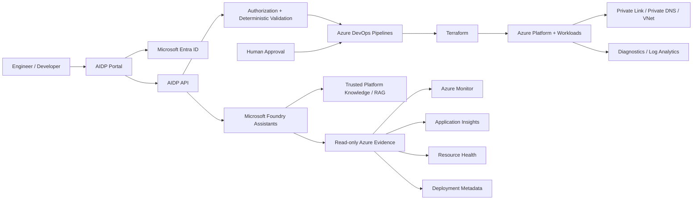

# Azure Intelligent Developer Platform Architecture

Status: Implemented portfolio architecture with ongoing hardening and polish.

AIDP is a secure self-service Azure platform that combines Infrastructure as Code, CI/CD, observability, private networking, identity controls, and safety-bounded AI assistance.

## High-level architecture



## Core platform components

### Developer portal

The React/Vite portal provides the user-facing entry point for supported platform operations. Microsoft Entra ID handles authentication, while authorization and request validation remain enforced by the backend.

### AIDP API

The API is the control boundary between user requests, Azure DevOps, Azure services, and AI capabilities. It performs deterministic validation, authorization, request sanitization, trusted evidence collection, and structured AI output validation.

### Azure DevOps and Terraform

Infrastructure delivery uses Azure DevOps YAML pipelines and Terraform.

Key controls include:

- separate platform and workload deployment flows;
- protected Terraform state;
- Workload Identity Federation instead of long-lived service-connection secrets;
- environment approvals before infrastructure changes;
- scoped deployment permissions;
- plan/apply separation and validation;
- reusable workload provisioning patterns.

The AI layer does not apply Terraform or approve deployments.

## Identity and security model

AIDP separates identity, authorization, infrastructure delivery, and AI advice.

- Microsoft Entra ID authenticates users.
- Backend rules determine what operations are allowed.
- Azure service access uses Managed Identity where applicable.
- Azure DevOps uses Workload Identity Federation.
- RBAC follows least-privilege principles.
- Local/key-based authentication is disabled where supported in the lab architecture.
- Secrets and Terraform state are excluded from source control.
- Human approval remains required for infrastructure changes.

## Networking architecture

The implemented platform demonstrates private service connectivity using:

- Azure Virtual Network and dedicated subnets;
- App Service VNet Integration for outbound private access;
- Private Endpoints for platform services such as Storage and Microsoft Foundry;
- Private DNS zones for service-name resolution;
- default-deny storage network controls;
- HTTPS and modern TLS enforcement.

The public portfolio repository uses sanitized example names and addresses rather than live environment identifiers.

## Observability architecture

AIDP centralizes operational evidence through:

- Azure Monitor;
- Application Insights;
- Log Analytics;
- App Service diagnostic settings;
- Resource Health;
- bounded App Service deployment metadata.

The platform uses this telemetry both for engineering troubleshooting and as trusted, read-only evidence for AI-assisted health analysis.

## AI architecture

The AI layer is intentionally capability-bounded.

Implemented assistants include:

- infrastructure review;
- deployment troubleshooting;
- application health analysis.

The assistants can use trusted platform knowledge and approved read-only Azure evidence, but they cannot:

- modify Azure resources;
- change RBAC;
- restart or scale workloads;
- execute Terraform;
- approve deployments;
- run arbitrary KQL;
- choose arbitrary Azure resource IDs.

Structured schemas, provenance rules, sanitizers, groundedness checks, adversarial evaluation, and semantic validators are used to reduce unsupported or unsafe output.

## Trusted evidence sources

AIDP uses a fixed catalog of approved evidence sources, including:

- Azure Monitor metrics;
- Application Insights summaries;
- Azure Resource Health;
- App Service deployment metadata;
- trusted platform documentation retrieved through RAG.

Evidence provenance is preserved so the platform can distinguish monitored facts, retrieved documentation, and model-generated explanation.

## Terraform state architecture

Terraform state is stored remotely in Azure Blob Storage and protected separately from application data.

The design uses:

- Microsoft Entra authentication;
- Azure RBAC;
- Shared Key disabled where supported;
- restricted storage-network access;
- separate state paths for platform and workload deployments;
- no Terraform state committed to Git.

The public repository includes only sanitized backend examples and does not contain live state configuration.

## Deployment flow

```text
Engineer
   |
   v
AIDP Portal
   |
   v
Entra authentication
   |
   v
AIDP API
   |
   +-- authorization
   +-- deterministic validation
   +-- sanitization
   |
   v
Azure DevOps pipeline
   |
   v
Terraform plan
   |
   v
Human approval
   |
   v
Terraform apply
   |
   v
Azure resources
   |
   v
Monitoring and health evidence
```

## Platform design principles

AIDP follows these priorities:

1. security and least privilege;
2. deterministic controls before AI judgment;
3. human approval for infrastructure changes;
4. trusted and bounded evidence sources;
5. private connectivity where justified;
6. centralized observability;
7. reusable infrastructure patterns;
8. cost-aware lab design.

## Current implementation status

Implemented capabilities include:

- Terraform platform infrastructure;
- workload provisioning pipeline;
- Entra-authenticated API access;
- Azure DevOps YAML pipelines;
- Workload Identity Federation;
- Managed Identity;
- private Storage and Foundry connectivity;
- centralized App Service diagnostics;
- RAG-backed platform knowledge;
- AI infrastructure review;
- AI deployment troubleshooting;
- live application health analysis;
- Azure Monitor evidence;
- Application Insights evidence;
- Resource Health evidence;
- deployment metadata evidence;
- deterministic AI safety and evaluation gates.

Remaining work is focused mainly on additional hardening, observability/cost controls, and recruiter-facing presentation rather than foundational architecture.

## Public portfolio scope

This repository is a sanitized portfolio representation. It intentionally excludes live subscription IDs, tenant IDs, credentials, service connection details, Terraform state, private endpoints, and environment-specific deployment values.